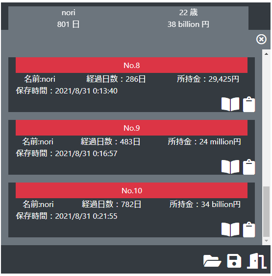

# Clicker_Empire_Game(Recursion Project3)

## URL
https://nori-ut3g.github.io/Clicker_Empire_Game/

## 概要
クッキークリッカーのようなインクリメンタルゲームです。[Recursion](https://recursionist.io/) の課題の一環で作成しました。
アイテムやフロントデザインはRecursionから提供されたものを参考にしましたが、コードはすべてオリジナルです。（作成日時2020年12月）

## 特徴
課題として提供された下記機能を追加しました。

### オートクリッカー
本家クッキークリッカーのように、自動的にクリックする機能を追加しました。
2秒で10回以上クリックしたときオートクリッカーが解放されます。

### セーブ・ロード機能
ローカルデータにセーブ機能を追加しました。
10個セーブデータが保存されますが、それ以上保存した場合は古いデータから削除されます。
Bookアイコンを押すと自動的にロードされます。

